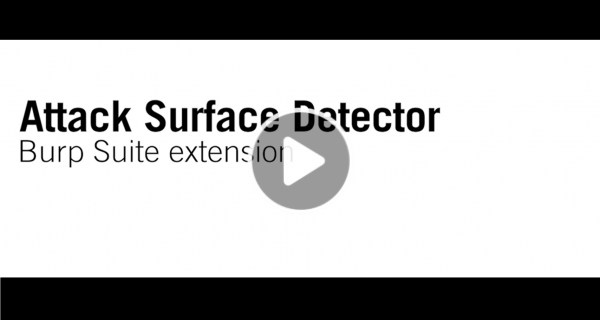
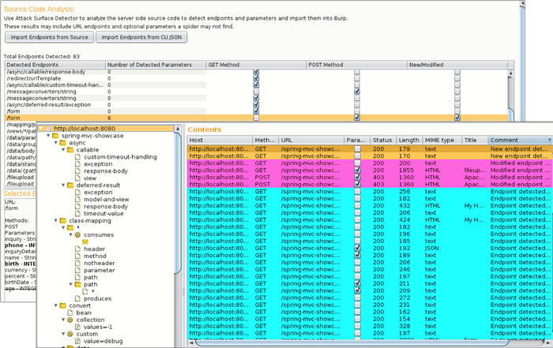

---

layout: col-sidebar
title: OWASP Attack Surface Detector
tags: attack-surface-detector
level: 2
type: tool

---

### Introduction
During web application penetration testing, it is important to enumerate your application's attack surface. While Dynamic Application Security Testing (DAST) tools (such as [OWASP ZAP](https://www2.owasp.org/www-project-zap/) and [PortSwigger Burp Suite](https://portswigger.net/)) are good at spidering to identify application attack surfaces, they will often fail to identify unlinked endpoints, optional parameters, and parameter datatypes and name. These endpoints and parameters not found often go untested, which can leave your application open to an attacker.

### What is the Attack Surface Detector?
The Attack Surface Detector tool uncovers the endpoints of a web application, the parameters these endpoints accept, and the data type of those parameters. This includes the unlinked endpoints a spider won't find in client-side code, or optional parameters totally unused in client-side code. It also has the capability to calculate the changes in attack surface between two versions of an application.

The Attack Surface Detector is available as a plugin to both ZAP and Burp Suite, and a Command Line Interface (CLI) tool is also available. The CLI tool exports the attack surface as a JSON output, which can then be used by the ZAP and Burp Suite plugin. This is helpful for cases where the source code is not provided to the penetration tester directly. The CLI tool can also be used for other custom integration where you want to discover an application attack surface or changes in the attack surface.

For a quick overview of the Attack Surface Detection tool, see this YouTube video:

Below is a screenshot of the Burp Suite Attack Surface Detector plugin where you can see a list of endpoints, endpoint details, and their corresponding requests:

### How it Works
The Attack Surface Detector performs static code analyses to identify web application endpoints by parsing routes and identifying parameters (with supported languages and frameworks). This data is made available in ZAP and Burp Suite to help improve testing coverage.

### Supported Languages and Frameworks

* **Java:**	JSPs, Servlets, Struts, Spring MVC
* **C#:**	ASP.NET MVC, Web Forms
* **Ruby:**	Rails
* **Python:**	Django

### Roadmap
We continue to improve the attack surface detection accuracy for existing supported languages and frameworks, and we are looking to add additional language support, particularly for PHP and Python. If there are any PHP or Python developers that are looking to contribute, [please let us know](mailto:info@codedx.com).
We are also looking to extend ASD for use in automated headless usage of ZAP and Burp and move the ASD ZAP plugin out of alpha classification, which requires [internationalization](https://github.com/zaproxy/zap-extensions/wiki/AddOnsBeta). If anyone can help, we would love your contributions.
Finally, we are really interested in what the community thinks will help improve ASD and we will adjust our roadmap based on that feedback.

### Getting Involved
Contributions to the Attack Surface Detector project are encouraged and welcome. Additions of new features and enhancements can be provided through GitHub. We are eager to get user feedback, so please [reach out to us](mailto:info@codedx.com) or fill out this [ASD survey](https://www.surveymonkey.com/r/D2N87GB).

### Licensing
The Attack Surface Detector plugin is free to use. It is licensed under the [link Mozilla Public License 2.0](https://www.mozilla.org/en-US/MPL/2.0/).

### Acknowledgements
The Attack Surface Detection project is led by [Code Dx](https://codedx.com/) and was developed in collaboration with [Denim Group](https://www.denimgroup.com/) under a research grant sponsored by the Department of Homeland Security (DHS) Science and Technology Directorate, Cyber Security Division (DHS S&T/CSD), BAA via contract number HHSP233201600058C.
