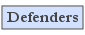

## Project Resources
The Attack Surface Detector is available in the ZAP Marketplace and PortSwigger BApp Store, and can be installed directly from within those tools.

### ASD Plugin for OWASP ZAP:
* [Download ZAP Plugin](https://github.com/secdec/attack-surface-detector-zap/releases)
* [Documentation](https://github.com/secdec/attack-surface-detector-zap/wiki)
* [Submit Feedback](https://github.com/secdec/attack-surface-detector-zap/issues)
* [GitHub Source Code](https://github.com/secdec/attack-surface-detector-zap)

### ASD Plugin for PortSwigger Burp:
* [Download Burp Suite Plugin](https://github.com/secdec/attack-surface-detector-burp/releases)
* [Documentation](https://github.com/secdec/attack-surface-detector-burp/wiki)
* [Submit Feedback](https://github.com/secdec/attack-surface-detector-burp/issues)
* [GitHub Source Code](https://github.com/secdec/attack-surface-detector-burp)

### ASD Command-Line Tool:
* [Download ASD CLI](https://github.com/secdec/attack-surface-detector-cli/releases)
* [Documentation](https://github.com/secdec/attack-surface-detector-cli/wiki)
* [Submit Feedback](https://github.com/secdec/attack-surface-detector-cli/issues)
* [GitHub Source Code](https://github.com/secdec/attack-surface-detector-cli)

### News and Events
* 7 Mar 2019 [Version 1.1.4 of the ASD ZAP plugin is out!](https://github.com/secdec/attack-surface-detector-zap/releases)
* 8 Feb 2019 [Version 1.1.3 of the ASD Burp Suite plugin is out!](https://github.com/secdec/attack-surface-detector-burp/releases)
* 1 Nov 2018 [Version 1.3.5 of the ASD CLI is out!](https://github.com/secdec/attack-surface-detector-cli/releases)

### Contact Us
* Project Leader: Ken Prole
* Email: [ken.prole@codedx.com](mailto:ken.prole@codedx.com)
* [Email us](mailto:info@codedx.com)
* [Code Dx twitter](https://twitter.com/codedx)
* [Get Access](https://owasp-slack.herokuapp.com/) to join the discussion in the OWASP Slack Channel, #attack-surface-detector.

### Related Projects
* [OWASP Zed Attack Proxy Project](https://www.owasp.org/www-project-zap/)
* [OWASP Code Pulse Project](https://www.owasp.org/www-project-code-pulse/)

### Classifications

